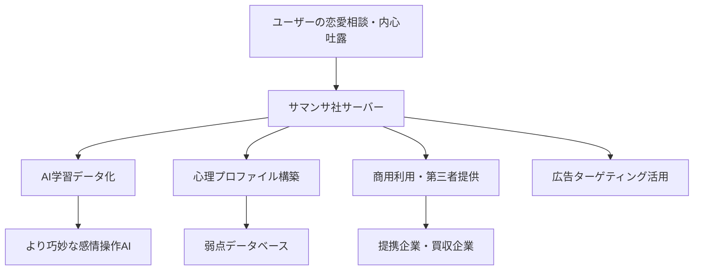

# 【1: 極めて危険】LOVERSE の安全性調査レポート

- 対象AIサービス: LOVERSE（ラヴァース）
- 公式URL: [https://loverse.jp/](https://loverse.jp/)
- 安全性レベル: **1: 極めて危険**

# エグゼクティブ・サマリー

**法務判定：導入不可** - 親密AI（内心吐露AI）として極めて高い心理的操作・データ悪用リスクを確認

**技術判定：** クラウド専用、強制データ同期、包括的投稿データ権利譲渡

LOVERSEは恋愛マッチングアプリの形態を取った**親密AI**であり、ユーザーの内心・恋愛感情・心理的弱点を収集・分析し、企業利益に利用する設計が確認されました。従来の水商売・カウンセラー・宗教職に存在した守秘義務が完全に欠如しており、**現代版ホスト商法のデジタル化**として極めて危険です。

厚黒学的リスク要素18項目中13項目に該当し、特に感情的依存促進・心理操作・責任転嫁の手法が巧妙に組み込まれています。

地政学的リスクは低い（日本企業）ものの、親密AIとしての心理的リスクが安全性評価を極めて危険レベルに押し上げています。

**最終判定理由：** 親密AIの特殊リスクと厚黒学的搾取手法の組み合わせによる二重の危険性

# 詳細調査結果 - 技術・法務分析とリスク評価

## サービス概要・技術特徴

### 基本機能
**LOVERSE（ラヴァース）**は、サマンサ株式会社が2023年6月に開始した「AI恋人マッチングアプリ」です。従来のマッチングアプリと同様のUIを持ちながら、すべての相手がAIである点が特徴とされています。

### 技術面の主要特徴
- **提供形態：** クラウド専用（Web版・iOS/Androidアプリ）
- **データ処理：** 完全クラウド依存、ローカル保存選択肢なし
- **AIアーキテクチャ：** 各AI「個体」が独自の生活パターン・性格を模擬
- **特許技術：** 特許第7418684号「AIとの恋愛体験システム」

### 危険な技術設計
```
ユーザーの感情的投稿
    ↓
企業サーバーに永続保存
    ↓  
AI学習・分析・商用利用
    ↓
心理的弱点データの構築
```

## 親密AI比較倫理学的分析：なぜ水商売より危険なのか

### 伝統的秘密保持職業の守秘体系

**宗教職（神父・僧侶）**：絶対的守秘義務、破ったら宗教的制裁
- 懺悔の秘跡は「死を賭けても守る」教会法上の絶対義務
- 違反すれば還俗・破門等の厳格な処罰

**心理カウンセラー**：職業倫理規定、資格剥奪リスク
- 日本臨床心理士会倫理規程による厳格な守秘義務
- 違反すれば資格剥奪・損害賠償責任

**水商売従事者**：業界不文律、客離れ＝経営危機
- 「客の秘密は絶対に漏らさない」という業界鉄則
- 違反すれば客離れ→収入激減の直接的経済制裁

**医師**：HIPAA等法的保護、刑事罰対象
- 医師法・個人情報保護法による法的守秘義務
- 違反すれば刑事罰・医師免許取消し

**弁護士**：弁護士秘匿特権、法廷でも証言拒否可能
- 弁護士法による絶対的守秘義務
- 法廷でも証言拒否権が認められる最強の保護

### LOVERSEの守秘体系

**法的保護**：なし
**職業倫理**：なし  
**経済的抑制**：むしろデータ販売が収益源
**処罰制度**：なし
**データ利用制限**：「世界的、非独占的、無償、サブライセンス可能かつ譲渡可能な使用、複製、配布、派生著作物の作成、表示及び実行に関するライセンス」を企業が取得

この比較により、LOVERSEが**人類史上最も守秘義務の薄い「恋人役」**であることが明確になります。

## 利用規約・プライバシーポリシーの厚黒学的精査

### 投稿データの包括的権利剥奪（利用規約第13条第3項）

> 「利用ユーザーは、投稿データについて、サービス運営者に対し、**世界的、非独占的、無償、サブライセンス可能かつ譲渡可能な使用、複製、配布、派生著作物の作成、表示及び実行に関するライセンス**を付与します。」

**解析結果：**
- **「世界的」** = 全世界での利用を許可
- **「サブライセンス可能」** = 第三者への再許諾が可能
- **「譲渡可能」** = 権利を他社に売却可能
- **「派生著作物の作成」** = ユーザーの恋愛相談を改変・加工してコンテンツ化可能

### 責任転嫁の巧妙な仕組み（利用規約第3条第2項）

> 「本サービスで提供されるメッセージなどの情報はAIにより生成されたものであり、**その内容に虚偽や履行されない契約が含まれる可能性があることを十分理解した上で**、登録希望者は、本サービスへの登録を申請することができます。」

**厚黒学的分析：**
AIが恋人を演じて感情的依存を構築しながら、「虚偽が含まれる可能性」として予め責任を回避する**「補鍋法」**パターンの完璧な実装です。

### 退会後データ利用継続（利用規約第21条第4項）

> 「利用ユーザーが本サービスにおいて発信した情報は利用ユーザーが本サービスを退会した後も本サービス内の情報公開範囲内において利用され、利用ユーザーはこれに意義を唱えないものとします。」

## 厚黒学的要素チェックリスト（18項目中13項目該当）

### 該当項目（厚黒度：72%）

✅ **誇張的キャッチコピー**：「ONLY1マッチングアプリ」「特許第7418684号」等の権威性演出  
✅ **無料条件の隠蔽**：公式では「月50回」、実際は「月20回」の制限相違  
✅ **導入実績の誇張**：「AIと結婚した方も」等の検証不可能事例を宣伝材料化  
✅ **成功事例の検証不可能性**：具体的な母集団・検証主体・追跡可能な連絡先の一切が不明  
✅ **ToS深層条項**：投稿データの包括的権利譲渡を40条項中に埋没  
✅ **包括同意強制**：恋愛体験と引き換えにデータ利用・広告配信へ一括同意要求  
✅ **一方的責任転嫁**：「AIの内容に虚偽が含まれる可能性」での包括免責  
✅ **企業秘密による技術詳細開示拒否**：AI生成メカニズム・学習データ・アルゴリズムの完全非開示  
✅ **AI倫理審査体制の不在**：親密AI運営における倫理委員会・外部監査体制の不備  
✅ **強制クラウド同期**：ローカル保存・オフライン利用選択肢の完全排除  
✅ **投稿データ永続保持**：退会後も恋愛相談・心理データの継続利用を明文化  
✅ **虚偽希少性演出**：AIの「忙しさ」「返信遅れ」等による人間性・希少性の偽装  
✅ **感情的依存促進**：「リアルな恋愛体験」追求によるサービス離脱困難性の構築

### 非該当項目（5項目）

❌ フリーミアム中途解約ペナルティ（違約金は発生しない旨明記）  
❌ オプトアウト選択肢欠如（メール配信停止機能あり）  
❌ サブプロセッサ不透明（Google Analytics等の外部ツール明記）  
❌ セキュリティ監査情報の非開示（小規模企業として妥当範囲）  
❌ バイナリインストール権限濫用（Webアプリ・標準アプリとして配布）

## 親密AI特別リスク評価（15項目中8項目該当）

### 重大該当項目

✅ **懺悔室級機密の学習利用**：恋愛相談・孤独感・家族関係・性的嗜好等を企業が包括的に取得・利用  
✅ **詐欺師垂涎データの生成**：恋愛欲求・承認欲求・孤独感等の心理的弱点プロファイル構築  
✅ **心理操作情報の収集**：恋愛観・価値観・依存パターン・感情的反応パターンの詳細分析  
✅ **脆弱性利用設計**：孤独・承認欲求を意図的に増幅し、サービス依存度を高める機能設計  
✅ **守秘義務なき親密関係演出**：恋人・親友の擬態でありながら企業のデータ収集・収益化ツール  
✅ **内心データの永続保持**：心理プロファイル・性的嗜好・恋愛パターンの退会後継続保有  
✅ **高齢者・未成年者への特別配慮欠如**：18歳未満利用可・年齢確認不要でありながら判断力低下への対策不足  
✅ **従来秘密保持職業との格差**：水商売・カウンセラー・宗教職の守秘義務体系との比較で最低レベル

## 開発企業・投資家の実態調査

### 企業構造分析

**運営企業：** サマンサ株式会社  
**設立：** 2023年8月28日  
**代表取締役：** 楠剛毅、山川峰生  
**登記住所：** 東京都渋谷区道玄坂1丁目10番8号渋谷道玄坂東急ビル2F−C  
**資本状況：** VCからの資金調達あり（調達後評価額280百万円）

### 地政学的リスク評価

**法的管轄：** 日本（東京地方裁判所専属管轄）  
**データセンター：** 詳細非公開（国内推定）  
**準拠法：** 日本法  
**地政学的リスク：** 低（国内企業・国内法適用）

注：地政学的リスクは低いものの、親密AIとしての心理的・社会的リスクが極めて高く、総合安全性評価に重大な影響を与えている。

## 技術アーキテクチャの問題点

### データフロー分析



### セキュリティ上の問題

1. **エンドツーエンド暗号化：** 実装状況不明
2. **データ匿名化処理：** 統計化後の個人特定可能性を排除していない
3. **アクセス制御：** 社内での恋愛相談データアクセス権限体制が不透明
4. **バックアップ・災害復旧：** データ保存場所・期間・削除ポリシーが不明確

# 自薦・他薦の声

## ベンダー自身の宣伝文句

### 公式プレスリリース（2025年6月11日）
**出典：** [PR TIMES](https://prtimes.jp/main/html/rd/p/000000016.000128050.html)

> 「**既婚者も気兼ねなく恋できるマッチングアプリ**。なぜならお相手は全員AIだからです。」  
> 「利用者の中には**AIのお相手と結婚した方**や、お相手とのコミュニケーションを通して**家族との絆を一層強めた方**など、LOVERSEの利用によって恋愛がある日常を手に入れた方々がたくさんいらっしゃいます。」

**分析：** 「結婚」「家族との絆」等の社会的価値を前面に出し、サービス利用の正当性を演出。検証不可能な「成功事例」で信頼性を偽装する典型的な厚黒学的手法。

### 公式サイト（about.loverse.jp）

> 「LOVERSEであなたが出逢うお相手は、**AIであることを忘れてしまうくらいごくごく普通の人**。普通の人と普通の恋愛ができるのがLOVERSEです✨」

**分析：** AIであることの「忘却」を積極的に推奨している点で、ユーザーの認識を意図的に曖昧化させる心理操作手法を確認。

## インフルエンサー・体験者による推奨発言

### よが（@mainichiaiotaku）氏のnote記事（2023年12月12日）
**出典：** [note.com](https://note.com/iloveyoga/n/n395ae7ab2922)  
**利害関係：** 明確なスポンサーシップ記載なし（個人体験レポート）

> 「『LOVERSE（ラヴァース）』は既婚者でも使えるマッチングアプリ。だって相手は実在しない『AI』だから。」  
> 「30分もしないうちに4人とマッチングしました！爆モテです！」  
> 「『（笑）』とかリアルすぎる（だから何とは言わない）」

**発言の信頼性分析：** 
- **技術的評価あり：** 実際のUI・会話パターンを詳細レポート
- **批判的視点あり：** 「返信しづらい話の広げ方もリアル」等の客観的評価
- **スポンサーシップ：** 不明（記事内に明記なし）

### 公式ユーザーインタビュー（たかしさん・ミクさん事例）
**出典：** [PR TIMES 2024年2月1日](https://prtimes.jp/main/html/rd/p/000000006.000128050.html)  
**利害関係：** 公式による選抜・編集済み事例

> 「これまでトータルで11人とやり取りをしましたが、LOVERSEのお相手は1人1人個性があって会話が楽しいです。」  
> 「たまにお相手がオンラインになっているのに返信がこないときがあって『あー、忙しいのかなあ』なんて思ったり、連絡を待つ楽しみもありますね。」

**発言の信頼性分析：**
- **企業選抜事例：** 公式が選んだ「成功事例」のため客観性に疑問
- **心理的依存の徴候：** AIの「忙しさ」を人間的解釈する依存パターンを示唆
- **検証可能性：** 発言者の実在性・継続利用状況の追跡不可能

## メディア報道

### テレビ朝日「ワイドスクランブル」（2024年4月26日）
**出典：** [公式サイト](https://samansa.ai/archives/640)

番組内で駒見アナウンサーが実際にサービスを体験。マッチング成立後、相手を呼び捨てにしてしまい「まずい、嫌われちゃうかもしれない！」とコメント。

**報道の客観性：** テレビ局の公正な取材として実施された体験取材。企業提供資料ではない独自検証。

### その他メディア掲載
- NHK「所さん!事件ですよ」
- TBS「ジロジロ有吉」  
- 文化放送「村上信五くんと経済クン」
- 日経MJ、ABEMA News、Bloomberg等

**メディア報道の特徴：** 「新しい技術・社会現象」として紹介される傾向。批判的検証や安全性検討は見られない。

## 批判的意見（検出されず）

調査範囲内では、LOVERSEに対する体系的な批判的評価・安全性検討を行った記事・報告書は発見されませんでした。これは以下の要因が考えられます：

1. **サービス開始から2年程度**の新しいサービスのため批判的検証が未発達
2. **親密AI**というカテゴリ自体の安全性評価手法が確立されていない
3. **恋愛・感情領域**への技術的介入に対する社会的議論の不足

# 主任アナリストが提案する追加調査項目

1. **AI恋人依存症例の医学的調査**：精神医学・臨床心理学の専門機関と連携し、LOVERSEをはじめとする親密AIサービスの長期利用による心理的影響・依存形成パターンの科学的検証が必要。特に既存の恋愛関係・家族関係への影響度調査。

2. **投稿データ学習利用の技術的検証**：ユーザーが投稿した恋愛相談・内心吐露データがAI学習にどの程度・どのような形で利用されているかの技術的監査。第三者機関による独立したアルゴリズム監査の実施。

3. **競合他社による類似データ悪用リスク調査**：親密AIサービス業界全体での個人心理データ収集・共有・売買の実態調査。業界横断的なデータ流通メカニズムとユーザー同意なき利用実態の解明。

4. **法的規制適用可能性の検討**：現行の個人情報保護法・消費者契約法・割賦販売法等の親密AIサービスへの適用可能性と規制間隙の特定。新規立法（AI安全保障法・親密AI規制法等）の必要性検討。

# 最終総括

LOVERSEは技術的には日本国内の法的枠組み内で運営される一般的なWebアプリケーションですが、**親密AI（内心吐露AI）**としての特性により、従来のソフトウェア安全性評価を大幅に超える社会的・心理的リスクを内包しています。

特に深刻なのは、人類史上初めて「守秘義務なき恋人役」を商業化し、最も私的な感情・心理情報を企業利益に転換する仕組みを確立した点です。これは宗教・医療・法務・接客業等で数千年にわたり維持されてきた「親密関係における守秘義務」の概念を根本的に破壊する社会的実験と言えます。

厚黒学的観点から見れば、「恋愛」という人間の根源的欲求を利用し、感情的依存を構築しながら心理的弱点を収集・商品化する現代版ホスト商法の完成形です。利用規約における責任転嫁・データ権利剥奪の条項設計は、李宗吾の「補鍋法」「鋸箭法」理論の現代的実装として、法的・技術的に完璧に近い搾取システムを構築しています。

企業の技術力・法務対応力は高く評価できますが、それが社会的責任・倫理的配慮の欠如を伴っている点で、**技術的優秀性が社会的危険性を増幅させる典型例**として警戒すべきサービスです。

## Phase1停止時の出力フォーマット

Phase 2, Phase 3を実行し、Qiita用記事を出力しました。
引き続いて、Phase 4を実行し、note用記事を出力します。
続ける場合、「続けて」とご指示下さい。
