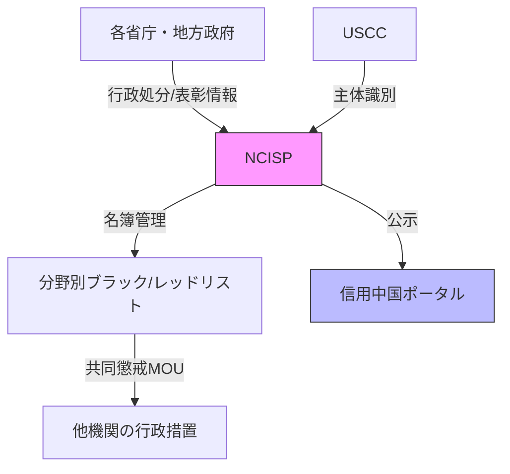

## はじめに

「中国の社会信用システム（Social Credit System, SCS）」と聞いて、多くの方は「国民全員にスコアが付けられて、低いと飛行機に乗れなくなる」といったイメージを持つかもしれません。しかし、**この理解は正確ではありません**。

本記事では、技術者と法務担当者向けに、SCSの実際のアーキテクチャを**事実ベース**で解説します。また、SCSとしばしば混同される**档案（dàng'àn）制度**との関係性を明確にし、「表と裏」の二層構造という統治メカニズムを解明します。後半では「SCSの国際展開の可能性」について、**確認できる事実**と**推測される戦略**を明確に区別して考察します。

:::note info
本記事の目的は政治的主張ではなく、**技術システムとしてのSCS**を正確に理解し、実務上のリスク評価に役立てることです。
:::

---

## 1. SCSとは何か：よくある誤解と実態

:::note info
**このセクションのポイント**:
西側メディアの報道により「中国は全国民にスコアを付けている」という誤解が広まりました。しかし実態は大きく異なります。SCSは単一スコアではなく、複数の分野別システムの連携基盤であり、中心的な仕組みは「ブラックリスト/レッドリスト」による名簿管理です。主な対象は企業と組織であり、個人向けは限定的です。正確な理解なしに対策を講じることはできません。本セクションでは、よくある誤解を明確に否定し、事実ベースでSCSの実態を解説します。
:::

### 1.1 よくある誤解

❌ **誤解1**: 中国には全国民に付与される「統一スコア」がある  
❌ **誤解2**: AIが自動的に市民を監視してスコアを下げる  
❌ **誤解3**: スコアが低いとあらゆるサービスが使えなくなる

### 1.2 実態

✅ **事実1**: SCSは**単一のスコアシステムではなく、複数の分野別システムの連携基盤**である[^1][^2]  
✅ **事実2**: 中心的な仕組みは**「ブラックリスト/レッドリスト」による名簿管理**である[^3]  
✅ **事実3**: 主な対象は**企業と組織**であり、個人向けは限定的[^4]

[^1]: DigiChina (Stanford), ["China's Social Credit System in 2021: From fragmentation towards integration"](https://digichina.stanford.edu/work/chinas-social-credit-system-in-2021-from-fragmentation-towards-integration/)
[^2]: Merics, ["China's Social Credit System: Fact vs. Fiction"](https://merics.org/en/report/chinas-social-credit-system-fact-vs-fiction)
[^3]: China Law Translate, ["Social Credit Overview"](https://www.chinalawtranslate.com/en/social-credit-overview/)
[^4]: US Congressional Research Service, ["China's Social Credit System: A Mark of Progress or a Threat to Privacy?"](https://crsreports.congress.gov/product/pdf/IF/IF11342)

---

## 2. 【重要】SCSと档案制度の関係

:::note warn
**なぜこのセクションが重要か**:
SCSを正確に理解するには、それが中国の統治システムの「表層」に過ぎないことを知る必要があります。その「裏層」に位置するのが档案制度です。両者の関係性を理解せずにSCSだけを見ると、中国の統治メカニズムの本質を見誤ります。
:::

### 2.1 档案制度とは何か

档案は中国語で「アーカイブ」を意味しますが、その実態は西側の公文書管理とは本質的に異なります。特に「人事档案」は、ソ連から継承された社会主義的統治手法であり、本人にすら公開されず誤りの訂正も困難という特性を持ちます。出生から現在まで、思想・言動・交友関係に至るまで記録されるこのシステムは、党が人民を評価・選別する上での決定的な情報源です。この制度を理解せずにSCSだけを見ると、中国の統治メカニズムの全体像を見誤ります。

**档案（dàng'àn）**は中国における文書記録管理制度ですが、その中でも**「人事档案」**は極めて特殊な個人管理システムです。

**人事档案の特徴**[^dangan1]:

| 項目 | 内容 |
|------|------|
| **収録内容** | 出生から現在まで: 家族構成、学校成績、党歴、職歴、結婚、言動、旅行歴、交友関係、犯罪歴など |
| **管理主体** | 所属機関の共産党人事部、または地方共産党支部の人事局・労働局 |
| **公開性** | **本人にすら非公開**。内容は国家秘密とされ、誤りの訂正も困難 |
| **法的根拠** | 『中華人民共和国档案法』(2020年改正) |
| **歴史** | ソ連から導入された社会主義的統治手法 |

[^dangan1]: 中華人民共和国档案法(2020年改正)および関連実施弁法

### 2.2 SCSと档案の「表と裏」二層構造

SCSと档案は制度上別レイヤーに位置しますが、実務上は相互補完的に機能します。SCSが「見せる道具」として公開・威嚇・連鎖制裁に用いられるのに対し、档案は「見せない道具」として秘匿の意思決定支援に使われます。この二層構造を理解することは、中国の統治システムの本質を把握する上で決定的に重要です。以下の表は、両制度の根本的な相違点を整理したものです。

**制度上の違い**:

| 項目 | 人事档案 | SCS(社会信用システム) |
|---|---|---|
| **目的** | 党・国家・事業単位の人事管理(任免・昇進・評価) | 遵法・行政執行の一元監督と連鎖制裁/優遇 |
| **データ源** | 党・機関の人事部門が蓄積 | 各省庁・地方の行政記録をNCISPで共有 |
| **公開性** | **非公開**(本人の知情・訂正権は限定) | **原則公開**(ブラック/レッド名簿や公示) |
| **役割** | **「裏の道具」**—秘匿の意思決定支援 | **「表の道具」**—威嚇・公開・連鎖制裁 |

### 2.3 【重要な洞察】なぜ二層構造なのか

党による統治において、「見せる情報」と「見せない情報」を分離することは組織原理として極めて合理的です。SCS/CCRは公開により威嚇と行動変容を誘導し、档案は秘匿により自由な意思決定を可能にします。この二層構造は単なる重複ではなく、効率性と秘匿性を両立させる洗練された設計です。実務上の相互波及メカニズムを理解することで、表面的な制度分析を超えた深い洞察が得られます。

**機能の相互補完**:

```
┌─────────────────────────────────────┐
│  SCS/CCR（表の道具）                   │
│  - 公開・威嚇                          │
│  - 連鎖制裁                            │
│  - 対外圧力                            │
│  - 行動変容の誘導                      │
└─────────────────────────────────────┘
              ↕ （相互参照）
┌─────────────────────────────────────┐
│  档案制度（裏の道具）                  │
│  - 秘匿                                │
│  - 意思決定支援                        │
│  - 人事評価                            │
│  - 情報収集                            │
└─────────────────────────────────────┘
```

**実務上の相互波及**[^dangan2]:

1. **共通する素材=行政記録**
   - 行政処分・表彰は档案に記載され、同じ事実がSCSの名簿にも掲載される可能性
   - SCSでの記録が人事評価（昇進・任免）に間接的に影響

2. **データ経路は別、公開域も別**
   - 档案は秘匿の人事アーカイブ
   - SCSは省庁横断のデータ連結→公示→共同懲戒
   - 自動連結の制度根拠は未確認

3. **デジタル化が間接連関を強化**
   - 電子化により同一人物の行政履歴が参照されやすくなる
   - ただし档案の非公開性という壁は維持

[^dangan2]: 档案法実施弁法および社会信用体系建設規画綱要の運用実態から推定

### 2.4 なぜこの区別が重要か

技術者と法務担当者にとって、SCSと档案の区別を理解することは実務上の必須要件です。公開されているSCS/CCRだけを見て「脅威は限定的」と判断すると、秘匿の档案システムという真の意思決定基盤を見落とします。データフローが「公開」と「秘匿」の二つのストリームに分かれている以上、技術的対策も両方に対応する必要があります。特に国際展開のリスク評価では、この二層構造を前提とした分析が不可欠です。

**技術者・法務担当者への含意**:

1. **SCSだけを見ても不十分**
   - 公開されているSCS/CCRは氷山の一角
   - 秘匿の档案システムが意思決定の真の基盤

2. **データフローの複雑性**
   - 「公開」と「秘匿」の二つのデータストリームが存在
   - 技術的対策も両方に対応が必要

3. **国際展開のリスク**
   - SCSの「部品輸出」だけでなく
   - 档案システムの「グローバル拡張」も考慮すべき

---

## 3. SCSのアーキテクチャ

SCSは単一の中央集権システムではなく、4層構造の複雑なネットワークです。統括ガバナンス層が全体を統制し、中枢プラットフォーム層がデータを集約・配信し、運用インストゥルメント層がブラックリスト/レッドリストで実際の制裁・優遇を実行し、分野・地域サブシステム層が各領域で具体的な運用を行います。この階層構造を理解することで、SCSが「どこに」「何を」「どう」記録し、「誰が」「どう使う」のかが明確になります。技術者にとっては実装の全体像を、法務担当者にとっては法的根拠と責任の所在を理解する上で必須の知識です。

### 3.1 全体構成図

SCSは単一のシステムではなく、4層からなる階層構造です。最上層の統括ガバナンスから、中枢プラットフォーム、運用インストゥルメント、そして実際の分野別サブシステムまで、各層が明確な役割分担を持っています。この構造を理解することで、SCSが「スコアシステム」ではなく「データ連結基盤」であることが明確になります。

```
┌─────────────────────────────────────────────────────────┐
│  ①統括ガバナンス層                                        │
│  └─ 国務院 連合会議（部際共同会議）                        │
│     主導: NDRC（国家発展改革委員会）+ PBOC（人民銀行）      │
└─────────────────────────────────────────────────────────┘
                          ↓
┌─────────────────────────────────────────────────────────┐
│  ②中枢プラットフォーム層                                   │
│  ├─ NCISP（全国信用情報共有平台）                          │
│  │   └─ 政府内のバックエンドデータ共有基盤                  │
│  └─ 信用中国（Credit China）                              │
│      └─ 対外公開ポータル                                   │
└─────────────────────────────────────────────────────────┘
                          ↓
┌─────────────────────────────────────────────────────────┐
│  ③運用インストゥルメント層                                 │
│  ├─ ブラックリスト/レッドリスト                            │
│  ├─ 共同懲戒/共同褒賞のMOU                                │
│  └─ USCC（統一社会信用コード）による主体識別               │
└─────────────────────────────────────────────────────────┘
                          ↓
┌─────────────────────────────────────────────────────────┐
│  ④分野・地域サブシステム層                                 │
│  ├─ 企業SCS（税務、環境、製品品質、サイバーセキュリティ）   │
│  ├─ 司法執行系（判決不履行者リストなど）                    │
│  ├─ 地方実験（一部都市のポイント制など）                   │
│  └─ 金融信用（個人信用情報、与信システム）                 │
└─────────────────────────────────────────────────────────┘
```

### 3.2 各層の詳細

4層構造の各層は、それぞれ異なる機能と責任を持っています。統括機構が政策を決定し、中枢プラットフォームがデータを集約・配信し、運用インストゥルメントが実際の制裁・優遇を実行し、サブシステムが分野ごとの運用を担当します。以下、各層の詳細を法的根拠とともに解説します。

#### ①統括ガバナンス層

誰がSCS全体を動かしているのか。複数の省庁が関与する巨大システムを統括するのは、国務院の連合会議体です。国家発展改革委員会(NDRC)と中国人民銀行(PBOC)が主導し、2014年の国家計画が青写真となっています。この層の理解は、SCSが単なる技術システムではなく国家戦略であることを示します。

**根拠文書**: 国務院「社会信用体系建設規劃綱要（2014–2020）」[^5]

- **統括組織**: 国務院 連合会議（部際共同会議）
- **主導機関**: 
  - NDRC（国家発展改革委員会）
  - PBOC（中国人民銀行）
  - SPC（最高人民法院）など

[^5]: DigiChina, ["Planning Outline for the Construction of a Social Credit System (2014-2020)"](https://digichina.stanford.edu/work/planning-outline-for-the-construction-of-a-social-credit-system-2014-2020/)

#### ②中枢プラットフォーム層

データはどこに集まるのか。NCISPは政府内のバックエンドで各省庁の信用情報を集約し、Credit Chinaは国民向けのフロントエンドとしてブラックリスト等を公開します。この二つのプラットフォームが、SCSのデータ連結における中枢神経系として機能しています。技術者にとって、この層の理解は実装アーキテクチャを把握する上で不可欠です。

**NCISP（全国信用情報共有平台）**[^6]
- **役割**: 政府内のバックエンドデータ共有基盤
- **機能**: 
  - 各省庁・地方の信用情報（行政処罰、表彰など）を集約
  - 共同制裁・共同褒賞の根拠データを配信
- **非公開**: 一般市民からは直接アクセス不可

**信用中国（Credit China）**[^7]
- **役割**: 対外公開ポータル
- **機能**:
  - ブラックリスト/レッドリストの公示
  - 政策文書の公開
  - 信用情報の検索機能
- **URL**: https://www.creditchina.gov.cn/

[^6]: US-China Economic and Security Review Commission, ["China's Social Credit System: A Mark of Progress or a Threat to Privacy?"](https://www.uscc.gov/research/chinas-social-credit-system-mark-progress-or-threat-privacy)
[^7]: Credit China 公式サイト: https://www.creditchina.gov.cn/

#### ③運用インストゥルメント層

制裁や優遇はどう実行されるのか。ブラックリスト/レッドリストという「名簿」形式が中心で、数値スコアではありません。ある機関でのリスト掲載が、共同懲戒MOUを通じて他分野の行政サービス制限に波及します。統一社会信用コード(USCC)が主体識別の鍵となり、この層が実際の制裁・優遇の実装メカニズムを担っています。

**ブラックリスト/レッドリスト**[^8]

```javascript
// 概念的な構造（実装例ではありません）
class 信用リスト {
  constructor(主体ID, リスト種別, 登録機関, 事由) {
    this.主体ID = 主体ID;           // USCC（統一社会信用コード）
    this.リスト種別 = リスト種別;   // "ブラック" または "レッド"
    this.登録機関 = 登録機関;       // 所管官庁
    this.登録事由 = 事由;           // 法令違反の具体的内容
    this.登録日 = new Date();
    this.有効期限 = null;           // 期限付きの場合
  }
  
  共同懲戒を適用() {
    // 他機関へのMOUに基づく制裁
    // 例: 入札制限、補助金停止、移動制限など
  }
}
```

**重要な特徴**:
- **数値スコアではなく「列挙式」**が中心
- ブラックリスト = 重大な法令違反に対する追加制裁
- レッドリスト = 優良な遵法行為への優遇措置

[^8]: China Law Translate, ["Joint Punishment"](https://www.chinalawtranslate.com/en/joint-punishment/)

**USCC（統一社会信用コード）**[^9]
- **形式**: 18桁の英数字
- **役割**: 企業・団体の唯一識別子
- **機能**: 各種信用情報を主体と紐付け

[^9]: China Briefing, ["China's Unified Social Credit Code System"](https://www.china-briefing.com/news/chinas-unified-social-credit-code-system/)

#### ④分野・地域サブシステム層

SCSは実際にどこで使われているのか。この層は用途別の「束」であり、企業SCS、司法執行系、地方実験、金融信用など、目的ごとに異なるサブシステムが存在します。最も成熟しているのは企業SCSで、税務・環境・製品品質などの遵法行為を一元監督します。個人向けは主に判決不履行者リストなど司法執行が中心です。

**A. 企業SCS（Corporate SCS）**[^10][^11]

最も成熟したサブシステム。以下の分野を統合監督：

- 税務遵守
- 環境規制
- 製品品質
- サイバーセキュリティ
- 労働安全
- 知的財産権

**仕組み**:
```
所管庁が分野別信用指標を付与
    ↓
NCISPで省庁間共有
    ↓
ブラック/レッド連動
    ↓
入札・補助金・金融サービスに影響
```

[^10]: European Chamber & Sinolytics, ["The Digital Hand: How China's Corporate Social Credit System Conditions Market Actors"](https://www.europeanchamber.com.cn/en/publications-archive/844/The_Digital_Hand_How_China_s_Corporate_Social_Credit_System_Conditions_Market_Actors)
[^11]: US Congressional Research Service, ["China's Social Credit System"](https://crsreports.congress.gov/product/pdf/IF/IF11342)

**B. 司法・執行系**[^12]

- **失信被執行人名単**: 判決不履行者リスト
- **影響**: 航空券購入制限、高級消費制限など
- **特徴**: 強力な共同懲戒の起点

[^12]: China Law Translate, ["Supreme People's Court Provisions on the Publication of the List of Dishonest Persons Subject to Enforcement"](https://www.chinalawtranslate.com/dishonest-persons-subject-to-enforcement/)

**C. 地方「市民スコア」型の実験**[^13]

- 一部都市で実験的プログラム（蘇州、杭州など）
- **参加は任意**
- 運用は都市ごとにバラバラ
- **全国統一の制度ではない**

[^13]: Merics, ["Local Government Experiments with Social Credit"](https://merics.org/en/report/chinas-social-credit-system-fact-vs-fiction)

**D. 金融信用（CCR）との区別**[^14]

- 百行征信などの個人信用情報システム
- 主目的は**与信・金融**
- SCSの行政的ブラック/レッドとは**制度上別レイヤー**
- データ連携は制度と同意に依存

[^14]: People's Bank of China, Credit Reference Center: http://www.pbccrc.org.cn/

---

## 4. データフローの実際

アーキテクチャの理解だけでは不十分です。実際にデータがどう流れ、どう処理され、どう使われるのかを把握する必要があります。本セクションでは、各省庁・地方政府からNCISPへのデータ集約、分野別ブラックリスト/レッドリストの生成、他機関への共同懲戒MOU経由の波及、そして信用中国ポータルでの公示という一連のフローを図示します。また、USCC（統一社会信用コード）による主体識別、標準化されたデータ形式、API/データ交換プラットフォームという技術的特徴も解説します。データフローを理解することで、どこに介入点があるのか、どこで情報漏洩のリスクがあるのかが見えてきます。

### 4.1 基本フロー

データはどのように流れるのか。各省庁・地方政府から発生した行政情報がNCISPに集約され、分野別ブラックリスト/レッドリストとして整理され、共同懲戒MOUを通じて他機関の行政措置に波及します。同時にCredit Chinaで公示されます。主体識別はUSCCで統一され、このフローが「信用情報の横断連結」という SCSの本質を体現しています。



### 4.2 技術的特徴

技術実装の観点から見たSCSの特徴は何か。USCC（18桁コード）による主体統一識別、標準化された信用情報レコード、API/データ交換プラットフォームによる連携、そして限定的な公開範囲です。ただしNCISPの詳細な技術仕様は非公開であり、以下の記述には推定を含むことに注意が必要です。

1. **主体識別**: USCC（18桁コード）で統一
2. **データ形式**: 標準化された信用情報レコード
3. **連携方式**: API / データ交換プラットフォーム（推定）
4. **公開範囲**: 基本情報とリスト掲載情報のみ

:::note warn
**注意**: NCISPの詳細な技術仕様は非公開です。上記は公開情報からの推定を含みます。
:::

---

## 5. 重要な誤解の訂正

SCSについては、メディア報道やポップカルチャーにより多くの誤解が流布しています。特に「全国統一の個人スコア」と「AIによる自動懲罰」という二つの誤解は根強く、これらを信じると対策の方向性を誤ります。本セクションでは、スタンフォード大学DigiChina、Merics、China Law Translateなどの信頼できる調査機関の研究に基づき、これらの誤解を明確に否定します。誤解を正すことは、真の脅威——制度化された名簿管理と行政決定に基づく連鎖制裁——を正確に理解するための第一歩です。

### 5.1 「全国統一の個人スコア」は存在しない

最も広まっている誤解がこれです。西側メディアの報道により「中国は全国民にスコアを付けている」というイメージが定着しましたが、実態は異なります。スタンフォード大学DigiChinaやMericsの詳細調査により、SCSの主流は「名簿管理+行政措置」であり、全国統一スコアは存在しないことが確認されています。この誤解を正すことが、真の脅威を理解する第一歩です。

**根拠**[^15][^16]:
- スタンフォード大学DigiChinaの調査
- Mericsの詳細レポート
- 複数の学術研究

**実態**:
- 主流は「名簿（リスト）+ 行政措置」
- 都市のスコア実験は限定的で全国互換ではない
- 個人向けは主に司法執行（判決不履行）が中心

[^15]: DigiChina, ["China's Social Credit System in 2021"](https://digichina.stanford.edu/work/chinas-social-credit-system-in-2021-from-fragmentation-towards-integration/)
[^16]: Merics, ["China's Social Credit System: Fact vs. Fiction"](https://merics.org/en/report/chinas-social-credit-system-fact-vs-fiction)

### 5.2 「AIが自動で罰を決める」わけではない

もう一つの重要な誤解が「AIの自動判定」です。実際には、行政処罰法に基づく人による決定、公開、救済手続が原則とされています。2025年3月施行の顔認証規制では「代替手段の提供」が義務化されるなど、技術使用には一定の制約があります。ただし、これは「AIが使われていない」という意味ではなく、最終決定に人が関与する建付けがあるという意味です。

**根拠**[^17]:
- 中国サイバースペース管理局（CAC）の顔認証規制（2025年3月）
- 行政処罰法の手続要件

**実態**:
- **人による行政決定** + 公開 + 救済手続が原則
- 顔認証などの技術使用には「代替手段の提供」が義務化（2025年3月施行）
- ブラックリスト掲載には通知と異議申立の機会が制度上存在

[^17]: CAC, ["Regulations on Facial Recognition Technology"](http://www.cac.gov.cn/) (2025年3月)

---

## 6. 最近の動向（2024-2025）

SCSと档案制度は静的なシステムではなく、継続的に進化しています。2024-2025年の動向として特に注目すべきは、国内でのSCS高品質発展行動計画による企業監督の強化、NCISPの記録件数の拡大公表、そして顔認証規制の強化（2025年3月施行）です。顔認証規制は一見「個人の権利保護」に見えますが、同時に大規模運用の正当化と均質化でもあります。これらの動向は、システムが成熟期に入りつつあることを示しており、国際展開の基盤整備が着実に進行していることを意味します。

### 6.1 国内動向

SCSと档案制度は静的なシステムではなく、継続的に進化しています。2024-2025年の国内動向として特に注目すべきは、高品質発展行動計画による企業監督の強化、NCISPの記録件数の拡大公表、そして顔認証規制の強化です。顔認証規制は一見「個人の権利保護」に見えますが、同時に大規模運用の正当化と均質化でもあります。

**高品質発展に向けた強化**[^18]
- 信用情報の共有・開示強化
- 企業監督への活用継続
- NCISPの規模拡大（公表された記録件数の増加）

**顔認証規制の強化**[^19]
- 2025年3月施行の新規制
- 代替手段の提供義務
- 個人の同意強化

[^18]: NDRC, ["Social Credit System Construction Action Plan (2024-2025)"](https://www.ndrc.gov.cn/)
[^19]: CAC, ["Regulations on Facial Recognition Technology Applications"](http://www.cac.gov.cn/)

### 6.2 国際動向

SCSと档案制度の国際展開については、確認できる事実と推測を明確に区別する必要があります。監視インフラの輸出、国際標準化への積極的関与、データ統治原則の提唱などは確認済みの事実ですが、それらが統合されて「グローバル監視システム」となるかは推測の領域です。この部分の詳細は次のセクションで扱います。

この部分は**推測を含む**ため、次のセクションで詳しく扱います。

---

## 7. 【推測と事実の区別】国際展開の可能性

本セクションは記事の中核であり、最も慎重な評価が必要です。国内で高度に発展したSCSと档案制度が国境を越えて展開される可能性は、もはや単なる推測ではありません。国家情報法による協力義務、在外公館と統一戦線組織の実務装置、プラットフォーム企業からのデータアクセス事例、電子档案のリアルタイム編入体制——これらすべてのピースが揃っています。ただし「中央に完全統合された一冊の档案」の直接証拠は未確認であり、連邦型（分散収集→必要時統合参照）が最も現実的な実装形態です。本セクションでは、確認できる事実と推測される戦略を明確に区別し、技術システムとしてのリスク評価を提供します。

:::note warn
**重要な前提**:
以下の内容は、**確認できる事実**と**推測される戦略**を明確に区別して記述します。また、SCSの国際展開を考える際には、前述の**档案制度との二層構造**も考慮する必要があります。政治的主張ではなく、技術システムとしてのリスク評価が目的です。
:::

### 7.1 結論（推測）

国際展開について最も重要な結論は、「全国統一スコア型のSCSをそのまま世界展開」という単純なシナリオは現実性が低いということです。しかし、SCSの「部品」（監視インフラ、国際標準、データ原則、企業評価）の段階的展開と、档案制度のグローバル化が並行して進行する可能性は高いと評価されます。「表と裏」の二層構造が国際的に再現されるシナリオを検討する必要があります。

**「全国統一スコア型のSCSをそのまま世界展開」は現実性が低い**

しかし、

**SCSを構成する「部品」を段階的に域外へ展開し、各国で類似のガバナンスを再現させる戦略は進行中の可能性がある**

さらに重要なのは、

**SCS（表の道具）の国際展開と並行して、档案制度（裏の道具）のグローバル化も進行している可能性がある**[^global-dangan]

[^global-dangan]: 这是基于档案法、国家情報法、電子档案管理弁法などの法的基盤と、在外公館・統一戦線組織などの実務装置が揃っている事実からの推測

### 7.2 【事実】档案制度のデジタル化とグローバル拡張の可能性

档案制度のグローバル化は推測ではなく、国内での基盤整備とグローバル展開の装置が既に確認できる事実です。2020年の档案法改正で電子档案に法的効力が付与され、2024年には電子档案管理弁法が施行されました。さらに民間ベンダーが「AI+干部画像」「智能问答」を商品化しており、生成AI/LLM的な機能が既に商品レベルに達しています。一方、国家情報法7条による協力義務、在外公館・統一戦線組織、ByteDance従業員によるTikTokデータ不正アクセス事例など、グローバル展開の装置も揃っています。これらは個別の断片ではなく、統合されたシステムの構成要素として理解すべきです。

#### A. 国内での基盤整備（確認済み事実）

**法的基盤**[^dangan-digital]:
- 改正档案法(2020): 「電子档案=紙と同等効力」を明記
- 『電子档案管理弁法』(2024施行): 電子档案の全ライフサイクル管理を統一化
- GB/T 33870-2017『干部人事档案数字化技術規範』: スキャン/メタデータ/交換/保全の要件を標準化

[^dangan-digital]: 中国国家档案局公式サイトおよび関連法規

**技術基盤**[^dangan-ai]:
- 省・市レベルで党建・組織人事のオンラインプラットフォームが稼働
- 民間ベンダーが「AI+干部画像」「智能问答」を商品化
  - タグ抽出
  - 業績・談話記録のNLP分析
  - 適材配置の推奨
- **生成AI/LLM的な機能が既に商品レベル**

[^dangan-ai]: 中国の組織人事情報化関連の商品カタログおよび学術論文（CNKI等）

#### B. グローバル展開の装置（確認済み事実）

**収集レイヤー**[^global-collection]:
1. **公的ルート**
   - 大使館・領事館
   - 在外党組織
   - 統一戦線(UFWD)系団体
   - 「海外警務連絡点」（一部は各国で摘発済み）

2. **私的/準私的ルート**
   - **国家情報法7条**による「協力義務」
   - プラットフォーム企業のログやメタデータへのアクセス
   - 実例: ByteDance従業員が米記者のTikTokデータに不正アクセス（社内調査で認定、解雇）

3. **生体データ収集**
   - コロナ期の健康コードで顔認証と渡航・行動履歴の紐付け実装
   - アプリの過剰収集が継続的に発生（MIITの摘発・公表）
   - Safe/Smart City等、海外での顔認識を含む監視基盤の輸出

[^global-collection]: Safeguard Defenders報告、Reuters/Guardian報道、USCC報告

#### C. 推定される二層構造のグローバル展開

```
┌─────────────────────────────────────┐
│  SCS/CCR（表の層）                    │
│  ├─ Smart City インフラ              │
│  ├─ 国際標準化                       │
│  ├─ データ統治原則                   │
│  └─ 企業信用評価                     │
│     ↓                                │
│  【公開・威嚇・連鎖制裁】             │
└─────────────────────────────────────┘
              ↕ （相互参照）
┌─────────────────────────────────────┐
│  グローバル档案（裏の層）【推測】     │
│  ├─ 在外公館からの人物情報           │
│  ├─ プラットフォームデータ           │
│  ├─ 生体データ（顔・声紋等）         │
│  └─ AIによるプロファイリング         │
│     ↓                                │
│  【秘匿・意思決定支援・情報収集】     │
└─────────────────────────────────────┘
```

**重要な推測**:
- SCSの「部品輸出」は**表の道具の展開**
- 档案システムの「グローバル拡張」は**裏の道具の展開**
- 両者が統合されることで、**完全な二層構造の監視システム**が国際的に機能する可能性

### 7.3 【事実】輸出されている「部品」

SCSの国際展開は、完成品としての「システム輸出」ではなく、部品の段階的な展開という形で進行しています。監視・Smart Cityソリューション、国際標準化活動、データ統治原則の提唱、企業SCS型の評価メトリクス、越境データ枠組みの整備——これらの「部品」は独立して無害に見えますが、各国で組み合わさることで「事実上のSCS的ガバナンス」が再現されます。重要なのは、これらが推測ではなく確認可能な事実であることです。Huawei等によるエクアドルECU-911、ITUでの顔認証標準提案、GDSI（グローバルデータセキュリティイニシアティブ）、企業SCSの欧州商会レポート——すべて公開情報として確認できます。

#### 1. 監視・Smart Cityソリューション

**確認できる事実**[^20][^21]:
- Huawei等による監視統合プラットフォームの輸出
- 例: エクアドルのECU-911システム
- 中央アジア・アフリカ諸国への導入実績
- AU（アフリカ連合）本部のデータ外送疑惑（Le Monde報道、2018年）[^22]

[^20]: Council on Foreign Relations, ["China's Digital Silk Road"](https://www.cfr.org/blog/chinas-digital-silk-road-strategic-technological-competition-and-exporting-political-illiberalism)
[^21]: Freedom House, ["The Global Expansion of AI Surveillance"](https://freedomhouse.org/report/freedom-net/2019/crisis-social-media)
[^22]: Le Monde, ["In Addis Ababa, China's spy game in the African Union headquarters"](https://www.lemonde.fr/afrique/article/2018/01/26/a-addis-abeba-le-siege-de-l-union-africaine-espionne-par-les-chinois_5247521_3212.html)

#### 2. 国際標準の提案活動

**確認できる事実**[^23][^24]:
- ITU（国際電気通信連合）での標準提案
- 顔認証・群衆管理の技術仕様
- **懸念点**: 属性データの中央蓄積を前提とする仕様（Carnegie Endowment、ITIFの分析）

[^23]: Carnegie Endowment, ["Exporting Digital Authoritarianism"](https://carnegieendowment.org/research/2022/10/exporting-digital-authoritarianism-the-russian-and-chinese-models?lang=en)
[^24]: Information Technology and Innovation Foundation, ["Who Is Winning the AI Race: China, the EU or the United States?"](https://itif.org/publications/2019/08/19/who-winning-ai-race-china-eu-or-united-states/)

#### 3. データ統治原則の提唱

**確認できる事実**[^25][^26]:
- GDSI（グローバルデータセキュリティイニシアティブ）の提唱（2020年）
- APEC越境データ協力構想（2025年11月表明）
- 金融データ越境ガイドライン（2025年4月）
- 上海FTZデータ輸出ホワイトリスト（2024年5月）

[^25]: Ministry of Foreign Affairs of China, ["Global Data Security Initiative"](https://www.fmprc.gov.cn/mfa_eng/wjb_663304/zzjg_663340/jks_665232/kjfywj_665252/202009/t20200908_678431.html)
[^26]: China Daily, ["China proposes cross-border data cooperation at APEC"](http://www.chinadaily.com.cn/) (2025年11月)

#### 4. 企業SCS型の評価メトリクス

**確認できる事実**[^27]:
- 企業の規制順守メトリクスを信用判断に組み込む設計
- 金融・調達でのリスク評価への展開可能性
- 欧州商会とSinolyticsの詳細レポート

[^27]: European Chamber & Sinolytics, ["The Digital Hand"](https://www.europeanchamber.com.cn/en/publications-archive/844/The_Digital_Hand_How_China_s_Corporate_Social_Credit_System_Conditions_Market_Actors)

### 7.4 【推測】二層構造の統合展開シナリオ

確認済みの事実から論理的に導出される推測として、二層構造（表のSCS/CCR + 裏の档案）のグローバル展開シナリオを提示します。これは陰謀論ではなく、組織原理との整合性、法的基盤、技術基盤、実務装置の確認に基づく合理的推論です。観測レイヤーの展開から始まり、規範・標準の内在化、評価レイヤーの接続へと進行します。重要なのは、各段階が独立して進行可能であり、完全な統合がなくても部分的な機能が実現できることです。これにより外交コストとリスクを最小化しつつ、段階的な能力構築が可能になります。

以下は**推測**です：

```
【段階A】観測レイヤの展開
↓ Smart City / 監視カメラ / VMS / 顔認証標準
↓ → データが同一仕様で採取・保存される下地

【段階B】規範・標準の内在化
↓ ITU標準 / データ原則（GDSI系）
↓ → 合法な形での実装を可能にする

【段階C】評価レイヤの接続
↓ 企業の遵法データ → 調達・金融での参照
↓ → 各国制度内で「事実上のスコア化」
```

### 7.5 【事実】兆候として監視すべきポイント

抽象的なシナリオだけでなく、実務で「今、ここで」検知すべき具体的な兆候を列挙します。これらは推測ではなく、実際に日本の自治体、大学、企業が直面しうる現実的なリスクです。調達仕様書での中央DB保存要件、Safe/Smart City導入での中国ベンダー一元化、入札条件での信用記録連携要求、在外公館を介した人物確認依頼、中国系プラットフォームによるKYC代替提案、生体データの包括的収集要求——これらの兆候を早期に検知することが、グローバル监视システムへのデータ流出を防ぐ第一の防壁です。本項目は実務のチェックリストとして直接使用できるよう設計されています。

技術者・法務担当者が実務で確認すべき項目：

#### SCS関連の兆候

1. **国内法にない"顔・行動属性の常時保存"要件**を含む標準/要件書の採用
2. **Safe/Smart City**導入で、中核クラウド・VMS・指揮台帳が中国ベンダーに一元化
3. **官公庁・国営企業の入札条件**に「信用記録」連携や当局ポータル公開の条文
4. **データ越境MOU**で、中国側の監査／再提供権限や相互通行が盛り込まれる

#### 档案関連の兆候

5. **在外公館を介した人物確認依頼の増加**
   - 「人物の実在・素性確認」依頼が非公式に増える
   
6. **中国系プラットフォーム/ベンダーによるKYC代替提案**
   - 本人性/資格確認などKYC相当を肩代わりする提案
   
7. **推薦状の真正証明を大使館経由で求める運用の恒常化**
   - 研究/留学・招聘で推薦状の真正証明を大使館経由で求める

8. **生体データの包括的収集要求**
   - 顔認識、声紋、歩容（歩き方）、その他バイオメトリクスの要求
   - カメラ・マイク・Bluetooth等のセンサー権限の包括的要求
   - **理由**: 生体データは档案システムにおける「個人同定(Resolve)・継続追跡(Persist)・プロファイル更新(Profile)」の「キー素材」として機能

---

## 8. 実務的な対策（推奨事項）

脅威を理解するだけでは不十分です。実務レベルでの具体的な対策が必要です。本セクションでは、調達・契約時の最低限のアーキテクチャ要件、稼働中の技術的監視項目、契約上の「赤信号ワード」という三つの防御レイヤーを提示します。特に重要なのは生体データの遮断です。顔認識、声紋、歩容などの生体データは変更不可能な究極の個人識別子であり、一度流出すれば永続的なリスクとなります。これは档案システムにおける「個人同定・継続追跡・プロファイル更新」の「キー素材」として機能するため、最優先の防御対象です。本セクションの推奨事項は、すぐに実務で使えるチェックリストとして設計されています。

### 8.1 調達・契約時

技術的防御の核心は、契約・調達の段階で適切な要件を設定することです。データの主権と境界を明確に確立し、鍵管理システム(KMS)を国内に配置し、入札仕様で中央集約を排除し、契約で越境移転を禁止します。特に生体データの遮断は最優先課題です。これらは単なる「ベストプラクティス」ではなく、グローバル监视システムへのデータ流出を防ぐ必須の防壁です。技術的対策なしに組織的・政策的対策は機能しません。

**最低限のアーキテクチャ要件**:

#### SCS/監視インフラ対策

```typescript
interface 安全なシステム要件 {
  データ最小化: {
    属性: "目的限定のみ",
    保存期間: "短期TTL設定",
    収集範囲: "必要最小限"
  };
  
  鍵管理: {
    主体: "発注者（自組織）",
    場所: "国内IDC",
    外部アクセス: "禁止"
  };
  
  システム冗長性: {
    VMS: "複数ベンダー対応",
    顔認証: "置換可能な設計",
    ロックイン回避: "データ可搬性条項"
  };
  
  公開範囲: {
    統計データ: "匿名化のみ",
    名簿連鎖: "自国法の行政決定＋救済手続の範囲内"
  };
}
```

#### 档案システム対策

**生体データの遮断(最優先)**:

```typescript
interface 生体データ保護要件 {
  センサー権限: {
    カメラ: "業務必須の場合のみ",
    マイク: "業務必須の場合のみ",
    Bluetooth: "最小化",
    位置情報: "目的限定"
  };
  
  生体認証: {
    顔認識: "代替手段の必須提供",
    声紋: "代替手段の必須提供",
    指紋: "デバイスローカル処理のみ",
    虹彩: "禁止または厳格な制限"
  };
  
  データ処理: {
    保管場所: "国内のみ",
    保管期間: "必要最小限",
    用途: "明示的同意を得た目的のみ",
    第三国移転: "原則禁止"
  };
}
```

**理由**:
- 生体データは**変更不可能な究極の個人識別子**
- 一度流出すれば永続的なリスク
- 档案システムにおける「個人同定(Resolve)・継続追跡(Persist)・プロファイル更新(Profile)」の「キー素材」

**人物確認プロセスの分離**:

```yaml
推薦状・証明書の真正性確認:
  ✓ 自組織での直接確認
  ✓ 第三者認証機関の利用
  ✓ ブロックチェーン等の技術的保証
  ✗ 外国公館経由の証明（極力回避）

KYC/本人性確認:
  ✓ 国内の信頼できる事業者
  ✓ eKYC with ローカル処理
  ✓ 公的身分証の直接確認
  ✗ 中国系プラットフォームへの委託
```

### 8.2 稼働中の監視

契約・調達時の防御だけでは不十分です。システム稼働後も継続的な監視が必要です。夜間トラフィックの異常、設定変更の履歴、生体データの流出、外国公館からの人物照会、OSINT/SNSでのメタデータ露出——これらを定期的に監視することで、早期に異常を検知し対応できます。特に要人周辺のOPSEC(Operational Security)は、ターゲット化されやすい人物を保護する上で決定的に重要です。

**技術的監視項目**:

1. **夜間トラフィック監視**
   - 国外ASNへの予期しない通信
   - データ転送量の異常増加

2. **設定変更の監査**
   - 鍵管理設定の変更履歴
   - アクセス権限の変更ログ

3. **コンプライアンス確認**
   - 名簿連携要求の法的根拠
   - 救済手続の整備状況

#### 档案関連

4. **生体データの流出監視**
   - アプリのセンサー権限使用状況
   - 生体データの暗号化状態
   - バックグラウンドでのデータ送信

5. **人物確認要求の記録**
   - 外国公館からの人物照会の頻度・内容
   - KYC代替提案の有無と内容
   - 推薦状真正証明の経路

6. **OSINT/SNS露出の管理**
   - 要人のメタデータ露出
   - 組織構造・人間関係の公開情報
   - 位置情報・移動パターンの漏洩

### 8.3 契約上の「赤信号ワード」

契約書や仕様書に特定の文言が含まれている場合、それは重大なリスクの兆候です。「顔特徴値の常時保存」「中央リポジトリ必須」「鍵管理はベンダー」といった文言は、データ主権の喪失を意味します。さらに档案関連では「大使館経由の人物確認」「中国系プラットフォームによるKYC代行」といった提案が警戒すべきサインです。これらの「赤信号ワード」を法務・調達担当者が認識していれば、契約締結前にリスクを回避できます。

#### SCS/インフラ関連

以下の文言が含まれる場合は要注意：

- 「顔特徴値・生体属性の**常時保存**」
- 「**中央リポジトリ必須**」
- 「提供先の**再提供を許容**」
- 「監査は**ベンダー指定機関のみ**」
- 「鍵管理は**ベンダー**」

#### 档案関連

以下の提案・要求は特に警戒：

- 「人物の実在確認を**大使館/領事館経由で実施**」
- 「KYC/本人確認を**当社プラットフォームで代行**」（中国系ベンダー）
- 「生体データの**包括的収集と長期保管**」
- 「推薦状・証明書の真正性を**外国公館が証明**」
- 「顔認証を**必須認証手段**とし代替手段なし」

---

## 9. まとめ

本記事を通じて、中国の社会信用システム（SCS）の実態、档案制度との二層構造、そして国際展開の可能性について詳述してきました。重要なのは、センセーショナルな報道に惑わされず事実に基づいて評価する一方で、表面的な制度分析に留まらずシステムとしての統合可能性を理解することです。SCSは「表の道具」として公開・威嚇・連鎖制裁に使われ、档案は「裏の道具」として秘匿・意思決定支援に使われます。両者が統合されることで、完全な二層構造の監視システムが機能します。技術者と法務担当者にとって最も重要なのは、個別技術ではなくシステム的視点を持ち、特に生体データの遮断を最優先課題とすることです。

### 9.1 SCSの実態（事実）

SCSについての最も重要な発見は、それが「全国民にスコアを付けるシステム」ではないということです。4層からなる多層ネットワークであり、ブラックリスト/レッドリストによる名簿管理が中心で、主な対象は企業です。この正確な理解なくして、真の脅威——制度化された横断連結と連鎖制裁——を評価することはできません。

1. **単一スコアではなく、多層ネットワーク**
   - ①統括機構 ②中枢プラットフォーム ③運用インストゥルメント ④分野別サブシステム

2. **主な運用は「ブラックリスト/レッドリスト」**
   - 数値スコアより名簿管理が中心
   - 行政決定 + 公開 + 救済手続が原則

3. **主な対象は企業**
   - 企業SCSが最も成熟
   - 個人向けは司法執行が中心

### 9.2 档案制度との二層構造（重要な発見）

本記事の最も重要な発見は、SCSが統治メカニズムの「表層」に過ぎないということです。その背後には、秘匿性の高い档案制度という「裏層」が存在します。SCSが公開・威嚇・連鎖制裁の道具であるのに対し、档案は秘匿・意思決定支援の道具です。この二層構造を理解せずにSCSだけを見ると、中国の統治メカニズムの本質を見誤ります。両者は相互補完的に機能し、デジタル化により間接連関が強化されています。

**SCSは「表の道具」、档案は「裏の道具」**:

| レイヤー | SCS/CCR | 档案制度 |
|---------|---------|---------|
| 公開性 | 公開・公示 | 秘匿（本人にも非公開） |
| 目的 | 威嚇・連鎖制裁・行動変容 | 意思決定支援・人事評価 |
| データ源 | 行政記録（省庁横断） | 人事記録（党・機関） |
| 法的根拠 | 社会信用体系建設規画 | 档案法 |

**相互補完的な関係**:
- 両制度は別レイヤーだが実務上相互参照
- 行政処分・表彰という「共通素材」が両方に記録
- デジタル化により間接連関が強化

### 9.3 国際展開の可能性（推測含む）

国際展開については、確認できる事実と推測を明確に区別する必要があります。監視インフラの輸出、国際標準化活動、データ統治原則の提唱、档案制度のデジタル化、国家情報法による協力義務——これらは確認済みの事実です。推測されるのは、これらの「部品」が統合されて「表と裏」の二層構造が国際的に再現されるシナリオです。直接的な「システム輸出」ではなく、各国制度内での間接的な再現が合理的です。

**確認できる事実**:
- 監視インフラの輸出実績
- 国際標準への積極的提案
- データ統治原則の提唱
- 企業評価メトリクスの体系化
- **档案制度のデジタル化（電子档案管理弁法、AI分析ツールの商品化）**
- **国家情報法による協力義務**
- **在外公館・統一戦線組織の実務装置**

**推測される戦略**:
- **表の層**: SCS「部品」の積み上げによる既成事実化
- **裏の層**: 档案システムのグローバル拡張（在外公館経由の人物情報、プラットフォームデータ、生体データ）
- **統合**: 各国制度内で二層構造の監視システムを再現

### 9.4 技術者・法務担当者へのメッセージ

本記事の分析を踏まえ、実務担当者が今日から実践すべき6つの行動指針を提示します。誤解を正すこと、二層構造を理解すること、システム的視点を持つこと、生体データを遮断すること、具体的なチェックポイントを設けること、そしてデータ主権を確立すること。これらは抽象的な警告ではなく、明日の調達会議や契約レビューで直ちに適用できる実践的な指針です。

**1. センセーショナルな報道に惑わされず、事実に基づいて評価すること**

SCSについての誤解（「全国民にスコアが付けられる」など）を正すことは重要ですが、それによって本質的な脅威を過小評価してはいけません。

**2. 「表と裏」の二層構造を理解すること**

- **表の層（SCS/CCR）**: 見える脅威—公開・威嚇・連鎖制裁
- **裏の層（档案）**: 見えない脅威—秘匿・意思決定支援・情報収集

両方を統合して初めて、統治メカニズムの全体像が見えてきます。

**3. システム的視点を持つこと**

個別技術や制度は無害に見えても、**システムとして統合される可能性**が真の脅威です：

```
監視インフラ（観測）
    ↓
国際標準（規範）
    ↓
データ統治原則（正当化）
    ↓
企業評価メトリクス（公開層）
    ↓
生体データ収集（同定）
    ↓
档案システム（秘匿層）
```

**4. 生体データの遮断を最優先すること**

生体データは：
- 変更不可能な究極の個人識別子
- 一度流出すれば永続的なリスク
- 档案システムにおける「個人同定(Resolve)・継続追跡(Persist)・プロファイル更新(Profile)」の「キー素材」

**5. 調達・運用・契約の各段階で具体的なチェックポイントを設けること**

本記事で示した「赤信号ワード」や監視項目は、実務で使える具体的な防御ツールです。

**6. 透明性の要求とデータ主権の確立**

- ベンダーの所有構造、開発拠点、法的管轄の確認
- 国家情報法7条の適用可能性の評価
- データローカライゼーション要件の明確化
- 外国政府の情報アクセス要求への透明性確保

---

## 参考文献

### 主要な一次資料

1. 国務院「社会信用体系建設規劃綱要（2014–2020）」[英訳: DigiChina]
2. NDRC「社会信用体系建設高質量発展行動計画（2024-2025）」
3. 信用中国（Credit China）公式サイト: https://www.creditchina.gov.cn/
4. **中華人民共和国档案法（2020年改正）**
5. **電子档案管理弁法（2024年施行）**
6. **GB/T 33870-2017『干部人事档案数字化技術規範』**
7. **中華人民共和国国家情報法（2017年、2018年改正）**

### 学術・分析レポート

**SCS関連**:
4. DigiChina (Stanford), "China's Social Credit System in 2021: From fragmentation towards integration"
5. Merics, "China's Social Credit System: Fact vs. Fiction"
6. China Law Translate, "Social Credit Overview & Joint Punishment"
7. US Congressional Research Service, "China's Social Credit System"
8. European Chamber & Sinolytics, "The Digital Hand"
9. US-China Economic and Security Review Commission, Reports on SCS

**档案制度・国際展開関連**:
10. **Safeguard Defenders, 海外警務拠点に関する報告**
11. **USCC, "China's Overseas United Front Work"**
12. **国家档案局公式サイト（档案制度のデジタル化関連）**
13. **中国の組織人事情報化に関する学術論文（CNKI等）**

### 国際展開関連

14. Council on Foreign Relations, "China's Digital Silk Road"
15. Freedom House, "The Global Expansion of AI Surveillance"
16. Carnegie Endowment, "Exporting Digital Authoritarianism"
17. ITIF, "Who Is Winning the AI Race"
18. Le Monde, AU本部データ外送疑惑報道（2018）
19. **Reuters, ByteDance従業員によるTikTokデータ不正アクセス事例（2022）**
20. **The Guardian, 欧州委員会のTikTok禁止措置（2023）**

---

## ライセンス・免責事項

- 本記事は公開情報に基づく分析です
- 推測部分は明示的に区別しています
- 政治的立場を表明するものではありません
- 実務での利用は自己責任でお願いします

---

**更新日**: 2025年10月9日（档案制度との関係性を追加）  
**著者**: [Your Name]  
**フィードバック**: 誤りや追加情報があればコメント欄でお知らせください

---

## 付録：用語集

| 用語 | 英語 | 説明 |
|------|------|------|
| SCS | Social Credit System | 社会信用システム |
| **档案** | **dàng'àn / Archives** | **中国の文書記録管理制度。特に「人事档案」は本人にも非公開の個人管理システム** |
| NCISP | National Credit Information Sharing Platform | 全国信用情報共有平台 |
| NDRC | National Development and Reform Commission | 国家発展改革委員会 |
| PBOC | People's Bank of China | 中国人民銀行 |
| SPC | Supreme People's Court | 最高人民法院 |
| USCC | Unified Social Credit Code | 統一社会信用コード |
| MOU | Memorandum of Understanding | 覚書 |
| CCR | Consumer Credit Reporting | 個人信用情報 |
| VMS | Video Management System | 映像管理システム |
| GDSI | Global Data Security Initiative | グローバルデータセキュリティイニシアティブ |
| **UFWD** | **United Front Work Department** | **統一戦線工作部** |
| **KYC** | **Know Your Customer** | **本人確認** |
| **OPSEC** | **Operational Security** | **作戦セキュリティ（情報漏洩防止）** |
