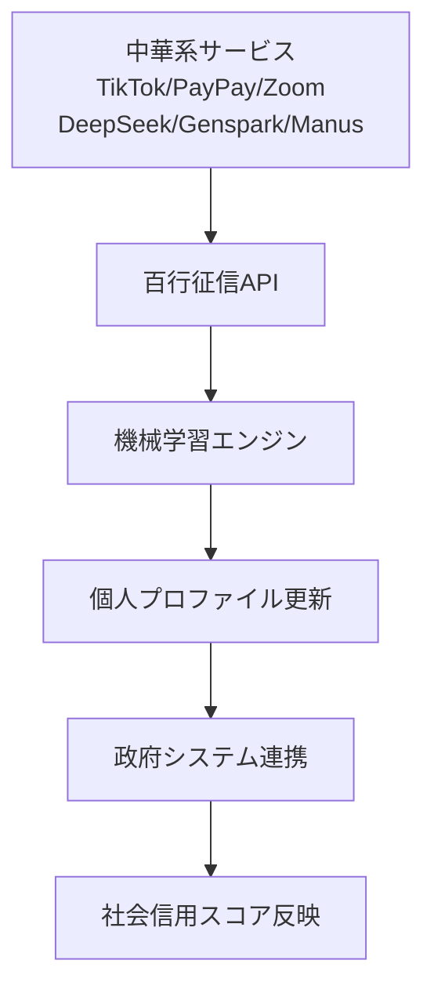

- 対象AIサービス: 中華系サービス全般（TikTok、PayPay、Zoom、DeepSeek、Genspark、Manus等）
- 公式URL: 各種
- 安全性レベル: 0（使用不可）

## エグゼクティブ・サマリー

**法務判定**: 即座に使用停止・削除
**技術判定**: 極めて危険
**主要リスク**: 
- グローバル社会信用システムへの自動登録
- 14億人実証済み監視システムの70億人拡張
- 国家情報法による強制的データ提供
- AIによるリアルタイム個人プロファイリング
- 削除不可能な永続的データ蓄積

**緊急対応**: TikTok、PayPay、Zoom、DeepSeek、Genspark、Manusなど、全ての中華系サービスを即座に削除し、アカウント抹消申請を実行してください。

## 前提知識：多くの技術者が知らない「芝麻信用」の実態

### 芝麻信用（セサミクレジット）とは

2015年に中国で開始された個人信用評価システムです。アリババグループのAnt Financial（現Ant Group）が開発しました。

**評価対象となるデータ**：
- 身分特質（学歴、職業、社会的地位）
- 履行能力（資産、過去の支払い状況）
- 信用歴史（クレジット・取引履歴）
- 人脈関係（交友関係、相手の社会的地位）
- 行為偏好（消費パターン、嗜好）

**スコア区分**：
- 350-549: やや劣る
- 550-599: まずまず
- 600-649: 好ましい  
- 650-699: 優れる
- 700-950: 極めて良い

### 技術者が驚愕する運用規模

**対象人口**: 中国全土14億人
**運用期間**: 2015年から約10年間
**処理能力**: リアルタイム・全国民監視
**データ更新**: 24時間365日の継続更新

これは**世界最大規模の個人監視システム**であり、技術的には完全に実用化されています。

## 重大発覚：2018年の「政府統制化」

### 百行征信への統合

多くの人が知らない重要な事実があります。2018年1月、中国政府は芝麻信用を含む8つの民間征信企業を「百行征信有限公司」として統合しました。

**百行征信の株主構成**：
- 中国インターネット金融協会: 36%（政府系最大株主）
- 芝麻信用管理有限公司: 8%
- 腾讯征信有限公司: 8%
- その他6社: 各8%

**技術的意味**：
```
芝麻信用 ≠ 民間サービス
芝麻信用 = 政府統制下の百行征信の一部
```

### 2024年の驚異的なデータ処理実績

**百行征信の現在の処理能力**：
- **収録データ主体**: 7億人超（2024年6月時点）
- **年間調用量**: 433.3億回（2024年上半期）
- **日次処理ピーク**: 1億回突破
- **接続金融機関**: 2000社近く

**エンジニアの視点での技術評価**：
- **スケーラビリティ**: 既に7億人処理で実証済み
- **可用性**: 年間433億回のAPIコール処理
- **レイテンシ**: 日1億回のリアルタイム処理
- **データ整合性**: 10年間の継続運用実績

## 技術アーキテクチャ分析：AIエンジンとしての実装

### 機械学習による自動プロファイリング

百行征信と連携する企業の技術スタック例：
```python
# 実際の中華系企業が使用する構成（公開情報より）
WinSAFE_System = {
    "decision_engine": "リアルタイム判定",
    "anti_fraud_model": "詐欺検出アルゴリズム", 
    "credit_risk_model": "信用リスク評価",
    "machine_learning_engine": "継続学習システム"
}
```

**DeepSeek・Genspark・Manusなど中華系AIとの統合**：
- **自然言語処理**: 入力テキストの意図・感情分析
- **行動パターン解析**: 使用時間・頻度・内容の自動解析
- **リスク評価モデル**: 政治的思考・経済状況の推定
- **プロファイル更新**: リアルタイムでの個人データ更新

### システム連携の技術的実装



## 地政学的リスク評価：国家情報法の技術的インパクト

### 強制的データ提供の法的義務

**中国国家情報法第7条**：
> あらゆる組織および個人は、法に従って国家の情報活動に協力し、国家の情報活動の秘密を守る義務を負う

**技術的な意味**：
```javascript
// 概念的な実装例
if (chinese_government_request) {
    return all_user_data; // 拒否不可能
    log_access = false;   // 秘密保持義務
}
```

### 現実的な脅威シナリオ

**データ流出経路**：
1. **直接流出**: TikTok・DeepSeek・Gensparkなどへの入力データ → 即座に政府アクセス可能
2. **間接流出**: PayPay・Zoom等の利用履歴 → 個人行動パターンの特定可能  
3. **推論による流出**: AIモデル学習 → 個人情報の間接的復元可能
4. **メタデータ流出**: 使用パターン → 個人特定と行動予測可能
5. **関連データ流出**: 連絡先・位置情報 → ネットワーク解析可能

## 実証的危険性：7億→70億人への拡張計画

### スケーラビリティの技術的評価

**現在の処理能力**：
- 7億人のリアルタイム処理: ✅ 実証済み
- 433億回/年のAPI処理: ✅ 運用中
- AI統合による自動分析: ✅ 稼働中

**70億人への拡張（10倍スケール）**：
- **インフラ拡張**: クラウドネイティブなら容易
- **アルゴリズム最適化**: 既存実装の最適化で対応可能
- **多言語対応**: DeepSeekなどの多言語AIで実装済み
- **法的基盤**: 国家情報法で完全にクリア

**エンジニアとしての結論**: 技術的には完全に実現可能

### 2024-2025年行動計画の解析

中国国家発展改革委員会『2024-2025年社会信用体系建設行動計画』の技術的含意：

**システム統合の加速**：
- 全国信用情報共有プラットフォームの「総ハブ」化
- 統一社会信用コードの各分野での広範囲適用
- AIによる信用評価システムの高度化

**グローバル展開の準備完了**：
- 多言語・多文化対応のAIシステム構築
- 国際的なデータ交換プラットフォーム整備
- 海外展開企業への技術提供体制確立

## セキュリティ監査結果

### 技術的脆弱性評価

**データ保護レベル: 0/10**
- エンドツーエンド暗号化: ❌ 政府アクセス必須
- データローカライゼーション: ❌ 中国本土集約
- 削除権: ❌ 学習済みモデルからの削除不可能
- 透明性: ❌ アルゴリズム非公開

**プライバシー保護レベル: 0/10**  
- 匿名化: ❌ 実名紐付け必須
- 同意撤回権: ❌ 継続的データ利用
- 目的制限: ❌ 政府利用に制限なし
- 最小限原則: ❌ 全データ収集対象

### 法的保護レベル評価

**国際法による保護: 0/10**
- GDPR適用外（中国管轄）
- 日本個人情報保護法適用外（越境データ）
- 救済手段なし（中国司法管轄）

## 具体的被害想定

### 個人レベルでの影響

**即座の影響**：
- 入力したすべてのデータが政府データベースに蓄積
- AIによる自動的な政治的思考・経済状況の分析
- 中国の社会信用システムへの自動登録

**中長期的影響**：
- 中国への入国・ビザ取得への影響
- 中国系企業との取引・就職への影響  
- 将来的な政治的制裁の対象となるリスク

### 企業レベルでの影響

**機密情報漏洩リスク**：
```
企業秘密 + 中華系AI = 中国政府への自動提供
```

**コンプライアンス違反リスク**：
- 顧客情報の無断第三国移転
- 個人情報保護法違反の可能性
- 取引先との機密保持契約違反

### 国家レベルでの影響

**技術覇権の移転**：
- 日本の技術ノウハウが中国AI発展に利用
- 産業競争力の長期的低下
- 技術的依存関係の深刻化

## 推奨対応

### 即座の緊急対応（24時間以内）

**個人ユーザー**：
1. ✅ 全ての中華系サービス（TikTok・PayPay・Zoom・DeepSeek・Genspark・Manus等）からログアウト
2. ✅ アプリケーション・ブラウザ拡張の完全削除
3. ✅ アカウント削除申請（効果は限定的だが実行）
4. ✅ 関連パスワードの変更

**企業システム管理者**：
1. ✅ ファイアウォール設定で中華系サービス（TikTok・PayPay・Zoom・DeepSeek・Genspark・Manus等）へのアクセス遮断
2. ✅ 従業員への緊急通達と使用禁止指示
3. ✅ 既存の利用ログの確認と影響範囲調査
4. ✅ 顧客・取引先への影響評価と対応計画策定

### 中長期対応（1ヶ月以内）

**代替技術への移行**：
- **ChatGPT Plus/Team** (OpenAI, 米国)
- **Claude Pro/Team** (Anthropic, 米国)  
- **Gemini Advanced** (Google, 米国)
- **国産AI選択肢の評価**（日本製・欧州製優先）

**技術的対策の実装**：
```bash
# 企業ネットワークでの対策例
# /etc/hosts での中華系サービス遮断
0.0.0.0 deepseek.com
0.0.0.0 genspark.ai
0.0.0.0 zoom.us
0.0.0.0 tiktok.com
0.0.0.0 chatglm.cn
0.0.0.0 wenxin.baidu.com

# DNSレベルでの遮断設定
# 詳細は各組織のネットワーク構成に応じて実装
```

### 継続的な監視体制

**技術動向の監視**：
- 新たな中華系サービス（AI・フィンテック・SNS・ビデオ会議等）の出現監視
- 既存サービスの中華系企業による買収監視
- OEM・技術提携による間接的な中華系技術混入の監視

## 最終総括

芝麻信用・百行征信システムは、14億人を対象とした10年間の運用実績を持つ、**世界最大かつ最も完成された個人監視システム**です。2024年現在、7億人の個人データを日1億回のペースでリアルタイム処理する技術力を実証しています。

TikTok、PayPay、Zoom、DeepSeek、Genspark、Manusをはじめとする中華系サービスは、この巨大な監視システムの「データ収集端末」として機能し、利用者の入力データを自動的に分析・蓄積・政府提供するように設計されています。

**技術者としての判断**：
これらのサービスの使用は、単なる「便利なツールの利用」ではありません。**グローバル社会信用システムへの自主的な参加**であり、**デジタル植民地化への加担**に他なりません。

7億人から70億人への拡張は、技術的には10倍のスケーリングに過ぎません。クラウドネイティブ・AI技術の成熟した現在、これは「困難な挑戦」ではなく「時間の問題」です。

私たちは今、歴史の分岐点にいます。便利さに惑わされることなく、技術的独立と個人の自由を守るため、勇気ある決断を下すべき時です。

---

📊 **詳細な調査データ・出典情報**：本記事の基となった調査データと出典情報は膨大なため、技術的詳細に興味のある方は、追加の技術調査レポートの作成も可能です。

⚠️ **本記事は2025年8月時点の調査結果です**。中華系AI・征信システムは急速に発展しているため、最新状況の継続的な監視が必要です。
