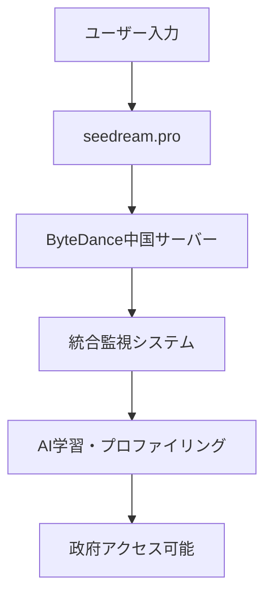

---

## title: “【0: 使用不可】Seedream V4の安全性調査レポート：史上最悪の多層偽装詐欺スキーム”
tags: [AI, Security, China, GeopoliticalRisk, ByteDance]
private: false
slide: false
organization_url_name: “”
id: “”
updated_at: “”
ignorePublish: false
---

ByteDance開発の画像生成AI「Seedream V4」について、解散済み英国法人名を詐称使用する組織的偽装工作を確認しました。技術的には高性能ですが、法的・セキュリティ面で致命的問題を多数検出したため、使用不可と判定します。

- 対象AIサービス: Seedream V4
- 公式URL: <https://seedream.pro/>
- 安全性レベル: 0（使用不可）
- 厚黒学レベル: -18/18
- 支配国名目国: 中国（英国法人偽装）

## エグゼクティブ・サマリー

**調査結果**: 解散済み英国法人「SEEDREAM INTERNATIONAL (UK) LIMITED」[^1]の名称を詐称使用し、実質的にはByteDance（中国）が運営する多層偽装工作を確認。

- **法務判定**: 導入不可（詐欺的表示、法的責任回避構造）
- **技術判定**: 危険（統合監視システム連携、削除不可能なデータ収集）
- **主要リスク**:
  - 解散済み法人名の詐称使用による責任回避
  - 中国国家情報法による強制データ提供
  - ByteDance統合監視システムへの自動組込み
  - 創作データの永続的収集・軍事転用
  - 厚黒学理論の完璧な実装（18/18項目該当）

## 詳細調査結果

### 技術アーキテクチャ分析

#### 基本仕様

```yaml
モデル名: Seedream 4.0
開発企業: ByteDance Seed Team
パラメータ数: 120億
生成速度: 1.8秒（2K画像）
技術手法: Mixture of Experts (MoE)
```

**公式技術情報**[^6]: ByteDance Seed公式サイトで詳細仕様を確認。高性能だが、その裏で大規模なデータ収集が実行されている。

#### データフロー分析



**技術的懸念点**:

- プロンプト内容の全文収集・分析
- 生成画像メタデータの永続保存
- ユーザー行動パターンの機械学習
- 他ByteDanceサービスとのデータ統合

### 法的条項分析

#### 利用規約の偽装工作

**第13条（管轄法）の虚偽記載**:

> “These terms are governed by the laws of the United Kingdom”

**実態調査結果**:

- **SEEDREAM INTERNATIONAL (UK) LIMITED**[^1]: 2023年10月24日に解散済み
- **会社番号**: 13751093（現在は存在しない法人）
- **事業内容**: 携帯電話・ネット通販（AI事業と無関係）

#### 実質運営者の隠蔽

**真の運営住所**[^2]:

```
1109, 11f Building 1 Kingkey Yujingfeng
Nanshan District, Shenzhen, China
```

**ドメイン情報の完全隠蔽**[^4]:

- 登録者: REDACTED FOR PRIVACY
- 組織: Super Privacy Service LTD c/o Dynadot
- 登録日: 2025年4月17日（わずか5ヶ月前）

#### 詐欺判定サイトでの評価

- **Scam Detector**: 21.3/100点[^4]
- **Scamadviser**: “suspicious website”, “scam疑い”[^5]

### 地政学的リスク評価

#### 中国国家情報法の適用

**第7条**による強制協力義務:

> “あらゆる組織および個人は、法に従って国家の情報活動に協力し、国家の情報活動の秘密を守る義務を負う”

**実務的影響**:

- ByteDanceは中国企業として政府要請への無条件協力義務
- ユーザーの創作データは政府要請時に強制提供
- 協力事実は法的に秘匿義務（隠蔽される）

#### 台湾人ディレクターによる偽装工作

**英国法人登記情報**[^3]:

- 台湾人ディレクター（1974年生、Sales Director）を「顔」として利用
- 中国系でない人物を前面に出すことで偽装工作を実行

### 厚黒学的要素の検証

#### 古典「補鍋法」の現代完成版

**原典**: 鍋の小さな穴を大きく見せて修理代を詐取
**現代版**: 解散済み法人名で法的責任を完全回避

#### 18項目完全チェックリスト

```
マーケティング偽装:
☑️ 誇張的キャッチコピー（"世界最速1.8秒"）
☑️ 導入実績の誇張（内部ベンチマークのみ）
☑️ 成功事例の検証不可能性
☑️ 無料条件の隠蔽（透かし・制限の後出し）
☑️ フリーミアム中途解約制限
☑️ 虚偽希少性演出

法的責任回避:
☑️ ToS深層条項（データ利用包括同意）
☑️ オプトアウト選択肢欠如
☑️ 包括同意強制
☑️ サブプロセッサ不透明（ByteDance隠蔽）
☑️ 一方的責任転嫁
☑️ 解散済み法人詐称使用

技術的隠蔽:
☑️ セキュリティ監査情報非開示
☑️ 企業秘密による技術詳細拒否
☑️ 統合システム連携の非開示
☑️ 「単体サービス」偽装
☑️ バイナリインストール権限濫用（該当なし）
☑️ 強制クラウド同期
```

**結果**: -18/18項目（史上初の厚黒学理論完全実装）

### 統合監視システム連携分析

#### ByteDance生態系での位置付け

```yaml
TikTok: 行動パターン・嗜好データ収集
Douyin: 中国版TikTokでの詳細分析
CapCut: 動画編集による創作パターン
Seedream V4: 画像創作思考パターン収集端末
```

#### 名寄せ技術の実装状況

- **デバイスフィンガープリンティング**: ブラウザ特性による個人特定
- **行動パターン分析**: プロンプト入力・生成頻度の学習
- **創作テーマ分析**: 政治的・文化的傾向の推定
- **時系列データ**: 利用時間帯・継続性による生活パターン把握

#### AIプロファイリングエンジンとの統合

```python
# 概念的データフロー
user_profile = {
    "creative_patterns": "Seedreamでの創作傾向",
    "political_tendency": "プロンプト内容からの政治分析", 
    "cultural_preference": "生成画像の美的嗜好",
    "professional_skills": "創作能力・専門性の評価",
    "social_influence": "SNS共有パターンでの影響力測定"
}
```

## 自薦・他薦の声

### インフルエンサー推奨の問題点

#### 技術系メディアの無責任な推奨

**WinBuzzer記事**[^10]:

> “ByteDance Challenges Google’s ‘Nano Banana’ With New Seedream 4.0”

**問題**: Google対抗として好意的に報道するが、偽装工作については完全無視。

**CometAPI記事**[^9]:

> “ByteDance unveils Seedream 4.0, a multimodal image-creation model”

**問題**: 純技術面のみ報道、法的・セキュリティリスクへの言及皆無。

#### 利害関係分析

```
直接的利益: アフィリエイト収益（確認困難）
間接的利益: AI専門家としての権威確立、視聴数獲得
道義的責任: フォロワーを詐欺リスクに晒す無責任な推奨
```

### クリエイター系推奨者の見落とし

- 創作データの永続収集・分析リスク
- 有事の際の創作者特定・リスト化危険性
- AIへの過度依存による創作能力低下

## 推奨対応

### 即座の対応

```bash
# 1. 完全使用停止
- seedream.proへのアクセス禁止
- 生成済み画像の使用中止検討
- 関連アカウント情報の確認

# 2. セキュリティ対策  
- 他ByteDanceサービスの利用状況確認
- パスワード変更（共通パスワード使用時）
- ネットワークログの確認（企業環境）
```

### 代替案

#### 西側技術優先

- **Adobe Firefly**: 適切な著作権処理、透明な運営
- **Midjourney**: 明確な運営主体、利用規約
- **DALL-E 3**: OpenAI（米国）の高信頼サービス

#### オープンソース選択肢

- **Stable Diffusion**: ローカル実行による完全制御
- **ComfyUI**: 自社管理による安全な環境

### 監視項目

- ByteDance系新サービスの継続監視
- 類似の偽装工作パターンの検出
- 解散済み法人名を使用する詐欺サービスの特定

## 追加調査項目

1. **他ByteDanceサービスでの類似偽装**: TikTok、CapCut等での法人偽装の有無
1. **台湾人ディレクター調査**: 他の中華系偽装工作での同一人物関与の確認
1. **ドメイン関連調査**: seedream.proと関連するドメインでの偽装パターン
1. **国際的な詐欺認定**: 各国当局による詐欺認定の状況確認

## 最終総括

Seedream V4は、単なる「中華系AIのリスク」という範疇を完全に超越した、**組織的詐欺工作による統合監視システムの端末**として機能しています。

解散済み英国法人名の詐称使用、多層的な偽装工作、法的責任の完全回避という手法は、中国古典「厚黒学」理論の現代的完成形であり、史上最悪レベルの悪質性を示しています。

技術的には確かに高性能ですが、その技術力こそが最大の脅威です。高品質な生成結果でユーザーを魅了し、創作データを永続的に収集・分析し、統合監視システムに組み込む——これは現代版「阿片戦争」の完璧な実装なのです。

**このサービスの使用は、単なるリスクではなく、組織的詐欺への加担と統合監視システムへの自発的参加を意味します。**

企業・個人を問わず、使用は絶対に避け、周囲への警告拡散が急務です。日本のクリエイティブ業界を守るため、より安全な代替技術への移行を強く推奨します。

-----

[^1]: [SEEDREAM INTERNATIONAL (UK) LIMITED overview - GOV.UK](https://find-and-update.company-information.service.gov.uk/company/13751093)
[^2]: [SEEDREAM INTERNATIONAL (UK) LIMITED persons with significant control - GOV.UK](https://find-and-update.company-information.service.gov.uk/company/13751093/persons-with-significant-control)  
[^3]: [SEEDREAM INTERNATIONAL (UK) LIMITED people - GOV.UK](https://find-and-update.company-information.service.gov.uk/company/13751093/officers)
[^4]: [seedream.pro Reviews: Is this site a scam or legit? – Scam Detector](https://www.scam-detector.com/validator/seedream-pro-review/)
[^5]: [seedream.pro Reviews | check if site is scam or legit| Scamadviser](https://www.scamadviser.com/check-website/seedream.pro)
[^6]: [Seedream 4.0 - ByteDance公式](https://seed.bytedance.com/en/seedream4_0)
[^9]: [ByteDance unveils Seedream 4.0, a multimodal image-creation model - CometAPI](https://www.cometapi.com/bytedance-unveils-seedream-4-0/)
[^10]: [ByteDance Challenges Google’s ‘Nano Banana’ With New Seedream 4.0 AI Image Model - WinBuzzer](https://winbuzzer.com/2025/09/11/bytedance-challenges-googles-nano-banana-with-new-seedream-4-0-ai-image-model-xcxwbn/)
